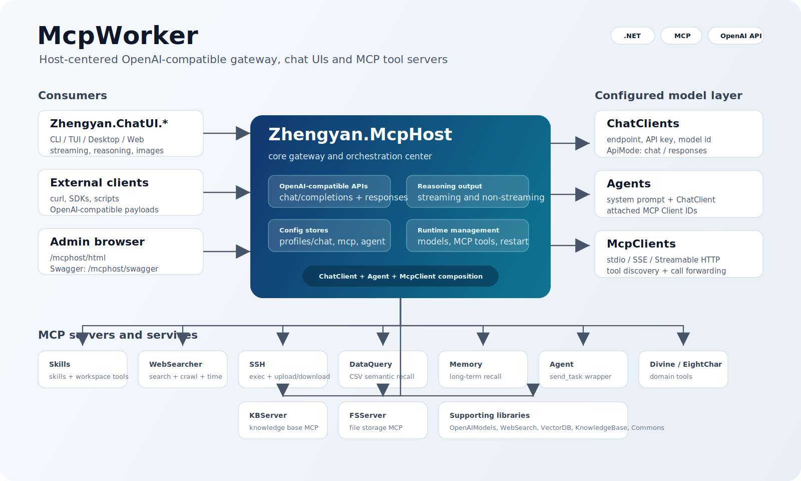

# McpWorker




`McpWorker` 是一个围绕 Model Context Protocol 构建的 .NET 工作区。它的核心是 `Zhengyan.McpHost`：一个本地可配置的 OpenAI 兼容网关，用来统一管理模型、Agent、MCP Client 和 MCP Server 工具，并向外提供 `/v1/chat/completions` 与 `/v1/responses` 两套对话接口。

当前仓库还包含四个对话界面项目、多个独立 MCP Server、知识库/文件服务以及一组底层模型、搜索、向量库和通用工具库。

## 核心路径

典型调用链如下：

```text
CLI / TUI / Desktop / Web / external OpenAI-compatible clients
        |
        v
Zhengyan.McpHost
        |
        +-- ChatClient: upstream model endpoint, API key, model id, chat/responses mode
        +-- Agent: system prompt + ChatClient + MCP Client list + API key expiration rules
        +-- McpClient: stdio / SSE / Streamable HTTP connection to MCP Servers
        |
        v
Zhengyan.McpServer.* / KBServer / FSServer
```

`McpHost` 既可以直接转发到上游模型，也可以根据当前选中的 Agent 组装系统提示词、模型配置和 MCP 工具列表，让普通 OpenAI 兼容客户端也能调用工具增强的 Agent。

## 快速开始

先构建解决方案：

```powershell
dotnet build McpWorker.sln
```

启动核心服务：

```powershell
dotnet run --project Zhengyan.McpHost\Zhengyan.McpHost.csproj
```

默认配置来自 `Zhengyan.McpHost/profiles/mcphost.json`。启动后常用地址是：

| 地址 | 用途 |
| --- | --- |
| `http://localhost:9083/mcphost/html` | McpHost 静态管理页 |
| `http://localhost:9083/mcphost/swagger` | Swagger |
| `http://localhost:9083/mcphost/api/v1/chat/completions` | OpenAI 兼容 Chat Completions |
| `http://localhost:9083/mcphost/api/v1/responses` | OpenAI 兼容 Responses |
| `http://localhost:9083/mcphost/api/v1/models/config` | 已配置 Agent/模型列表 |

启动一个 MCP Server，例如 WebSearcher：

```powershell
dotnet run --project Zhengyan.McpServer.WebSearcher\Zhengyan.McpServer.WebSearcher.csproj -- --mode streamablehttp --urls http://0.0.0.0:5001
```

然后在 `McpHost` 的 MCP Client 配置里连接：

```text
http://127.0.0.1:5001/websearcher
```

启动一个对话界面，例如 Desktop：

```powershell
dotnet run --project Zhengyan.ChatUI.Desktop\Zhengyan.ChatUI.Desktop.csproj
```

四个 ChatUI 默认都连接：

```text
http://localhost:9083/mcphost/api/v1
```

## Zhengyan.McpHost

`Zhengyan.McpHost` 是整个项目的核心。它负责：

- 管理 `ChatClient`：上游 OpenAI 兼容模型端点、API Key、模型 ID、调用模式。
- 管理 `McpClient`：连接本地或远程 MCP Server，支持 `stdio`、`sse`、`streamablehttp/http`。
- 管理 `Agent`：把一个 ChatClient 和多个 MCP Client 组合成可对话的模型配置。
- 提供 OpenAI 兼容接口：`/v1/chat/completions`、`/v1/responses`。
- 提供模型列表和切换接口：`/v1/models/config`、`/v1/models/switch`。
- 提供 Web 管理页和 Swagger。
- 同步输出推理过程：流式和非流式接口都会尽量保留上游返回的 reasoning/thinking 内容。

非流式推理输出约定：

- Chat Completions: 放在 `choices[].message.reasoning_content`。
- Responses: 在 `output` 中插入 `type: "reasoning"` 的输出项，并将内容放在 `summary[].text`，兼容百炼千问非流式 Responses 的结构。

更完整的配置、接口和调用示例见 [Zhengyan.McpHost/README.md](./Zhengyan.McpHost/README.md)。

## 对话界面

当前仓库包含四个 `Zhengyan.ChatUI.*` 项目。它们都面向 `McpHost`，都支持模型列表、模型切换、`chat/completions` 与 `responses` 两种接口、流式输出、推理过程展示和图片输入。

| 项目 | 界面类型 | 说明 |
| --- | --- | --- |
| [Zhengyan.ChatUI.CLI](./Zhengyan.ChatUI.CLI/README.md) | 命令行 | 交互式 CLI + 单次请求模式，适合脚本、管道和快速验证。 |
| [Zhengyan.ChatUI.TUI](./Zhengyan.ChatUI.TUI/README.md) | 终端 UI | 基于 Terminal.Gui 的全屏终端界面，包含设置、会话、Thinking、Additional 面板。 |
| [Zhengyan.ChatUI.Desktop](./Zhengyan.ChatUI.Desktop/README.md) | 桌面 UI | Avalonia 桌面客户端，适合长期调试和多模态对话。 |
| [Zhengyan.ChatUI.Web](./Zhengyan.ChatUI.Web/README.md) | Web UI | Gradio.Net 浏览器界面，适合局域网或本机快速访问。 |

## MCP Server

这些项目可以独立启动，也可以被 `McpHost` 通过 MCP Client 配置接入。多数 Server 支持：

```text
--mode stdio
--mode sse
--mode streamablehttp
--mode http
--stateless true|false
--urls http://0.0.0.0:<port>
```

| 项目 | HTTP MCP 路径 | 主要工具 |
| --- | --- | --- |
| [Zhengyan.McpServer.Agent](./Zhengyan.McpServer.Agent/README.md) | `/agent` | `send_task` |
| [Zhengyan.McpServer.DataQuery](./Zhengyan.McpServer.DataQuery/README.md) | `/dataquery` | `list_data_sources`, `query_data`, `rebuild_data_index` |
| [Zhengyan.McpServer.Divine](./Zhengyan.McpServer.Divine/README.md) | `/divine` | `divine_by_3_numbers`, `interpret` |
| [Zhengyan.McpServer.EightChar](./Zhengyan.McpServer.EightChar/README.md) | `/eightchar` | `calculation`, `interpret` |
| [Zhengyan.McpServer.Memory](./Zhengyan.McpServer.Memory/README.md) | `/memory` | `remember_memory`, `recall_memory`, `list_memories`, `forget_memory`, `rebuild_memory_index` |
| [Zhengyan.McpServer.Skills](./Zhengyan.McpServer.Skills/README.md) | `/skills` | Skills 检索、文件读写、文本搜索、命令执行等工作区工具 |
| [Zhengyan.McpServer.Ssh](./Zhengyan.McpServer.Ssh/README.md) | `/ssh` | `execute-command`, `upload`, `download` |
| [Zhengyan.McpServer.WebSearcher](./Zhengyan.McpServer.WebSearcher/README.md) | `/websearcher` | `SearchAsync`, `CrawlUrlsAsync`, `GetCurrentTime` |

## 支撑服务和库

这些项目不是 `McpHost` 的入口，但为 MCP Server、知识库、搜索、向量召回和通用 Web 能力提供支撑。

| 项目 | 说明 |
| --- | --- |
| [Zhengyan.KBServer](./Zhengyan.KBServer/README.md) | 知识库 HTTP + MCP 服务。 |
| [Zhengyan.FSServer](./Zhengyan.FSServer/README.md) | 文件存储 HTTP + MCP 服务。 |
| [Zhengyan.OpenAIModels](./Zhengyan.OpenAIModels/README.md) | OpenAI 兼容请求/响应模型。 |
| [Zhengyan.WebSearch](./Zhengyan.WebSearch/README.md) | 搜索引擎适配和网页抓取。 |
| [Zhengyan.KnowledgeBase](./Zhengyan.KnowledgeBase/README.md) | 知识库抽象和本地实现。 |
| [Zhengyan.VectorDB](./Zhengyan.VectorDB/README.md) | 本地向量库封装。 |
| [Zhengyan.HNSW](./Zhengyan.HNSW/README.md) | HNSW/SmallWorld 近邻搜索实现。 |
| [Zhengyan.Lunar](./Zhengyan.Lunar/README.md) | 农历、历法和八字相关基础库。 |
| [Zhengyan.Commons](./Zhengyan.Commons/README.md) | 通用工具。 |
| [Zhengyan.Commons.Web](./Zhengyan.Commons.Web/README.md) | Web 配置、Swagger、静态文件、Serilog 等扩展。 |
| [Zhengyan.Tests](./Zhengyan.Tests/README.md) | 手工测试和实验入口。 |

## 配置约定

仓库大量使用 `profiles/*.json` 保存配置。关键目录：

| 目录 | 内容 |
| --- | --- |
| `Zhengyan.McpHost/profiles/chat` | ChatClient 配置。 |
| `Zhengyan.McpHost/profiles/mcp` | McpClient 配置。 |
| `Zhengyan.McpHost/profiles/agent` | Agent 配置。 |
| `Zhengyan.McpServer.*/profiles` | 各独立 MCP Server 的运行配置。 |
| `Zhengyan.McpServer.Skills/resources/skills` | Skills 服务内置技能。 |
| `Zhengyan.McpServer.DataQuery/data` | DataQuery CSV 数据源。 |

请把配置文件里的端点、密钥、SSH 凭据、内网地址替换为自己的环境值。正式部署或公开发布前，不要提交真实凭据。

## 最小联调组合

只验证对话链路：

```text
Zhengyan.McpHost + 任意一个 Zhengyan.ChatUI.*
```

验证工具调用链路：

```text
Zhengyan.McpHost + 一个 ChatClient + 一个 Agent + 一个或多个 Zhengyan.McpServer.*
```

验证 Skills 工作区能力：

```text
Zhengyan.McpHost
Zhengyan.McpServer.Skills --mode streamablehttp --urls http://0.0.0.0:5006
McpHost MCP Client: http://127.0.0.1:5006/skills
```

## 构建脚本

根目录包含批量脚本：

```text
build_all.bat
build_all.sh
clean_all.bat
clean_all.sh
```

这些脚本会遍历子项目并调用对应项目自己的构建或清理脚本。日常开发更推荐先用 `dotnet build McpWorker.sln` 验证整体状态。
